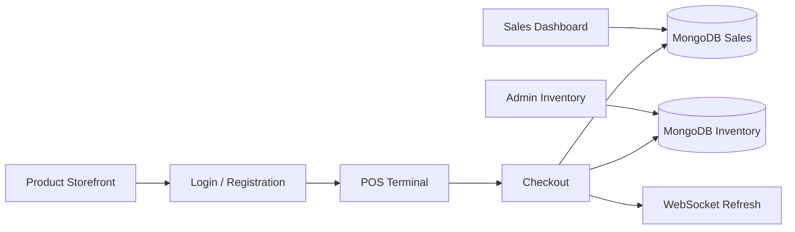

<div align="center">

# 💊 MedPlus

### Pharmacy E-Commerce & Point-of-Sale Management System

A full-stack pharmacy management prototype combining a product storefront, cashier POS, inventory administration, sales reporting, and real-time interface updates.

[](https://nodejs.org/)
[](https://expressjs.com/)
[](https://www.mongodb.com/)
[](https://ejs.co/)


[Overview](#-overview) · [Features](#-key-features) · [Getting Started](#-getting-started) · [Project Structure](#-project-structure) · [Roadmap](#-roadmap)

</div>

---

## 📖 Overview

**MedPlus** is a Node.js-based pharmacy storefront and point-of-sale (POS) application designed to demonstrate how product discovery, counter sales, inventory management, and sales records can work together in one system.

The application uses **Express.js** and **EJS** for server-rendered pages, **MongoDB/Mongoose** for data persistence, **express-session** for login sessions, and **WebSocket (`ws`)** for live update notifications and chat messages.

> **Project status:** Development / portfolio prototype. The current implementation is **not production-ready** and should not be used for real patient, customer, or payment data without further security and compliance work.

## ✨ Key Features

| Module | Capabilities |
| --- | --- |
| 🛍️ Product storefront | Browse pharmacy products with prices, categories, badges, and product images. |
| 🔎 Product search | Search by product name, brand, category, or description/subtitle. |
| 🖥️ Cashier POS | Session-based cart, quantity adjustments, item removal, and checkout. |
| 🧾 Checkout records | Generate receipt IDs and store sale line items with customer, cashier, and payment-method information. |
| 📦 Inventory management | Admin interfaces for adding, editing, and deleting products; manage stock, pricing, and image uploads. |
| 📊 Sales dashboard | View revenue, order counts, sold line items, cashier counts, and transaction history. |
| 👥 User sessions | Registration, login, logout, and separate cashier/admin screens. |
| ⚡ Real-time updates | WebSocket broadcasts for data refresh events and chat messages. |

**Important distinction:** The checkout currently **records** a selected payment method; it does **not** integrate a live payment gateway. Product labels and storefront marketing copy are demonstration UI content, not evidence of pharmacy licensing, delivery operations, or prescription validation.

## 🛠️ Tech Stack

| Layer | Technology |
| --- | --- |
| Runtime | Node.js |
| Web server | Express.js 5 |
| Templates | EJS |
| Database / ODM | MongoDB + Mongoose |
| Sessions | express-session |
| File uploads | Multer |
| Live messaging | WebSocket (`ws`) |
| Configuration | dotenv |
| Frontend | HTML, CSS, JavaScript, jQuery |

## 🚀 Getting Started

### Prerequisites

- Node.js and npm installed.
- A running **local MongoDB server** at `mongodb://127.0.0.1:27017`.
- Git (to clone the repository).

### 1. Clone the repository

```bash
git clone https://github.com/FardinAhasanDev/Medplus_E-Commerce_Site.git
cd Medplus_E-Commerce_Site
```

### 2. Install dependencies

```bash
npm install
```

### 3. Configure the session secret

Create a `.env` file in the project root:

```dotenv
SESSION_SECRET=replace_with_a_long_random_secret
```

Generate a suitable value with Node.js:

```bash
node -e "console.log(require('crypto').randomBytes(32).toString('hex'))"
```

Copy the generated value into `.env`. **Never commit `.env` or share its contents.** The repository's `.gitignore` excludes `.env` files.

> The current MongoDB connection string and server port are set directly in `server.js`: database `medplus_db` on local MongoDB, HTTP port `7000`.

### 4. Start the application

```bash
npm start
```

Open **http://localhost:7000** in your browser.

### 5. Explore the application

- Visit `/` to browse the storefront.
- Visit `/register` to create a development account, then `/login` to sign in.
- Visit `/terminal` to use the cashier POS after signing in.
- The inventory and sales screens are intended for admin users.

The database may be empty on first launch; add test products through the inventory interface after configuring a safe development admin account. **Do not expose the current registration/role assignment flow publicly.**

## 🗂️ Project Structure

```text
Medplus_E-Commerce_Site/
├── server.js                 # Express server, models, routes, and WebSocket logic
├── package.json              # Dependencies and npm scripts
├── package-lock.json
├── .gitignore
├── .env                      # Local secret (ignored; create this yourself)
├── public/
│   └── css/
│       └── style.css         # Application styling
├── views/
│   ├── partials/             # Shared header and footer
│   ├── home.ejs              # Product storefront
│   ├── login.ejs             # Sign in
│   ├── register.ejs          # Sign up
│   ├── terminal.ejs          # Cashier POS
│   ├── admin-inventory.ejs   # Inventory administration
│   ├── sales-log.ejs         # Sales history and summary
│   ├── checkout-success.ejs  # Checkout confirmation
│   └── error.ejs             # Error page
└── uploads/                  # Runtime product uploads (ignored)
```

## 🔗 Main Routes

| Method | Route | Purpose |
| --- | --- | --- |
| `GET` | `/` | Product storefront |
| `GET / POST` | `/register` | Account registration |
| `GET / POST` | `/login` | User login |
| `GET` | `/logout` | End the session |
| `GET` | `/terminal` | Authenticated POS terminal |
| `POST` | `/cart/add` | Add or increment an item |
| `POST` | `/cart/remove` | Decrement or remove an item |
| `POST` | `/cart/checkout` | Record a checkout and update stock |
| `GET` | `/admin/inventory` | Admin product management |
| `POST` | `/product/create` | Create a product |
| `POST` | `/product/update` | Update a product |
| `POST` | `/product/delete` | Delete a product if not linked to sales |
| `GET` | `/sales` | Admin sales report |
| `GET` | `/api/search?q=...` | Search products |
| `GET` | `/api/products` | Product data |
| `GET` | `/api/cart` | Authenticated cart data |
| `GET` | `/api/sales` | Admin sales data |

## 🔄 Application Flow



## 🔐 Security & Production Readiness

This repository is a **learning/portfolio project**, not a hardened pharmacy or payment platform. Before deployment, prioritize:

1. **Password security:** Replace plaintext password storage and comparison with a strong password hashing solution (for example, Argon2id or bcrypt).
2. **Authorization:** Remove automatic admin assignment based on the username; use controlled, server-side role provisioning.
3. **Session hardening:** Use a persistent session store, HTTPS-only secure cookies in production, and appropriate session/cookie settings.
4. **Input and upload validation:** Validate and sanitize user input, restrict file types and sizes, and add rate limiting and CSRF protection.
5. **Transaction safety:** Validate stock levels and use database transactions/atomic updates for checkout consistency.
6. **Privacy and compliance:** Establish appropriate controls before handling real customer or pharmacy-related data, including prescription workflows where applicable.
7. **Testing:** Add automated tests; the current `npm test` script is a placeholder.

## 🧭 Roadmap

- [ ] Secure authentication and admin role management
- [ ] Input validation, CSRF protection, and safer uploads
- [ ] Atomic checkout and low-stock safeguards
- [ ] Product pagination and advanced filtering
- [ ] Sales export and expanded reporting
- [ ] Automated tests and CI workflow
- [ ] Production deployment configuration and monitoring
- [ ] Payment integration and compliant pharmacy workflows (if required)

## 👨‍💻 Maintainer

Developed and maintained by **[FardinAhasanDev](https://github.com/FardinAhasanDev)**.

Repository: **[Medplus_E-Commerce_Site](https://github.com/FardinAhasanDev/Medplus_E-Commerce_Site)**

## 📄 License

The project currently declares **ISC** in `package.json`. Consult the repository's license terms before reuse or redistribution.

---

<div align="center">
  <sub>Built with Node.js, Express, MongoDB, and EJS.</sub>
</div>
